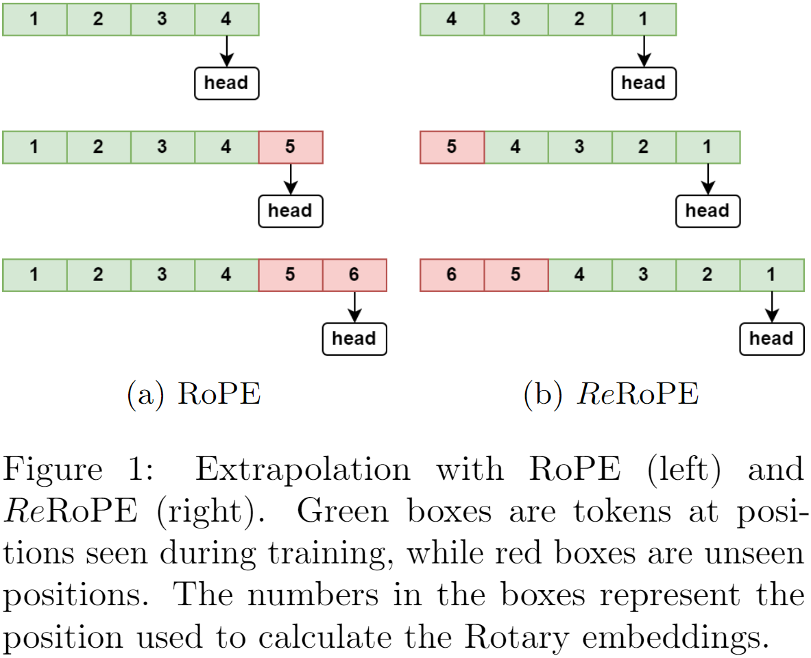
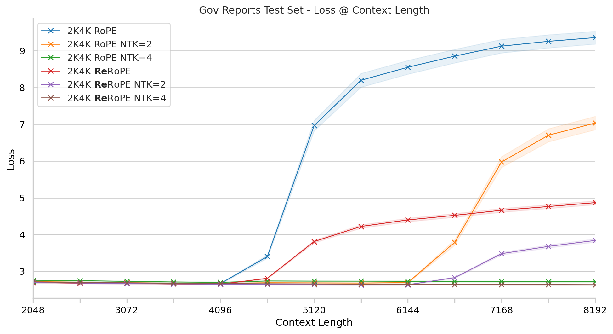
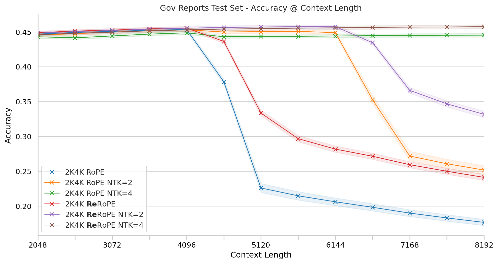

# ReRoPE - Reversed Rotary Positional Embedding

ReRoPE is a simple yet novel augmentation of [Rotary Position Embedding](https://arxiv.org/abs/2104.09864) which is able to reliably and significantly improve the performance of existing context window extension techniques without the need for fine-tuning. The only caveat to ReRoPE is the model needs to be pre-trained with ReRoPE to take advantage of the enhanced extrapolation behaviour.

## How it works
The idea is simple. Instead of computing the rotary positions for elements of a sequence from left to right, ReRoPE computes the positions from right to left; instead of the first token in your sequence being positon `1` and the last token being position `n` we flip things around so the last token in the sequence is always position `1` and the position index increases the further into the past the token is.

<div style="text-align:center" align=center><br></div><br>

Why does this work better? For vanillar RoPE when the LM head sits on 'unseen' positions during extrapolation we get a perplexity explosion because the rotations used for the both the queries and keys were never seen during training. But with ReRoPE the these unseen rotations are pushed as far away from the LM head as possible. ReRoPE still suffers from increased perplexity when extrapolating, but the degredation is more graceful than for vanilla RoPE.

In the graph below we compare two Transformer-XL style models on the [GovReport test set](https://github.com/tau-nlp/scrolls). We additionally run tests using [NTK Aware Scaling](https://reddit.com/r/LocalLLaMA/comments/14lz7j5/ntkaware_scaled_rope_allows_llama_models_to_have/) with `alpha=2` and `alpha=4` to observe the context window extension behaviours. Across all tests we observe ReRoPE suffers less when the context window is extended beyong the 'safe range.'

<div style="text-align:center" align=center><br></div><br>

Both models have 12 layers, an embedding dimension of 768, key dimension of 64 and use SwiGLU activation with an intermediate size of 3072. Both models were trained with 2048 context length + 2048 memory length on 30B tokens of The Pile with a batch size of 480 and using the LaProp optimizer with a max learning rate of `6e-4`.

## Code

Below is the minimal set of code needed to implement ReRoPE in PyTorch. The inclusion of `past_key_values` makes this perfect for use with HuggingFace models!

```py
class ReRotaryEmbedding( torch.nn.Module ):
    def __init__( self, dim: int, base_freq=10000, reversed=True ):
        super().__init__()
        self.dim = dim
        self.base_freq = base_freq
        self.reversed = reversed

    def forward( self, embeddings, past_key_values=None ):
        seq_len = embeddings.shape[-2] + ( past_key_values[0][0].shape[-2] if past_key_values is not None else 0 )
        device = embeddings.device
        
        pos = torch.arange( seq_len, device=device ).float()
        
        inv_freq = 1.0 / ( self.base_freq ** ( torch.arange( 0, self.dim, 2, device=device ).float() / self.dim ) )
        
        if self.reversed:
            pos = pos.flip( dims=[ 0 ] )

        rope_pos = torch.einsum( 'i,j->ij', pos, inv_freq )
        rope_pos = torch.cat( ( rope_pos, rope_pos ), dim=-1 )

        return rope_pos

def _rotate_half( x ):
    x1, x2 = x.chunk( 2, dim=-1 )
    return torch.cat( ( -x2, x1 ), dim=-1 )

def _apply_rotary_pos_emb( pos, t ):
    return ( t * pos.cos() ).type( t.dtype ) + ( _rotate_half( t ) * pos.sin() ).type( t.dtype )

def apply_rope( query, key, rope_pos ):
    q_length = query.shape[-2]
    k_length = key.shape[-2]

    # Get rotary embeddings for queries and keys
    rope_pos_q = rope_pos[ -q_length : ]
    rope_pos_k = rope_pos[ -k_length : ]

    query = _apply_rotary_pos_emb( rope_pos_q, query )
    key = _apply_rotary_pos_emb( rope_pos_k, key )

    return query, key
```

## Citation
If you use this codebase, or otherwise found our work valuable, please cite the paper once released in the coming weeks.

If you wish to cite this work before then, you may refer to this repository and link to [my Semantic Scholar profile](https://www.semanticscholar.org/author/Avelina-Asada-Hadji-Kyriacou/2139984073).
